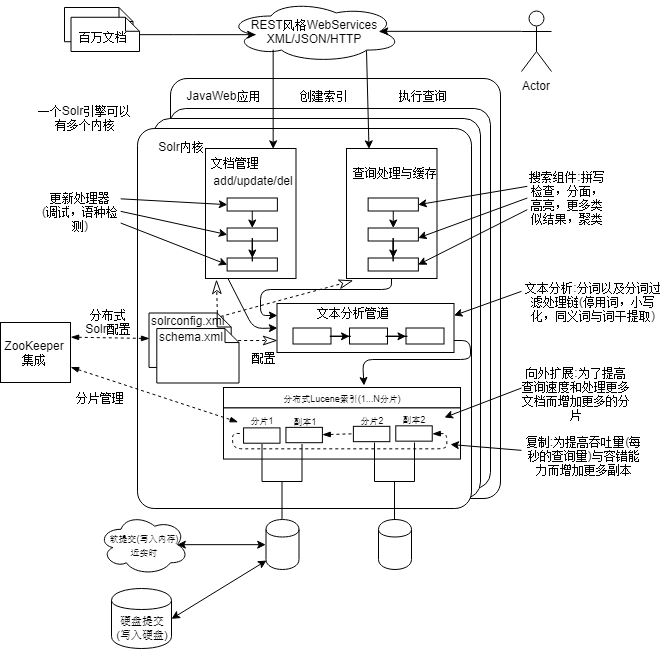

# Solr入门

为了解决现代Web应用的可扩展性和可用性需求，非关系型数据存储与处理技术(NoSQL,Not only SQL)越来越重视，Solr也是一种NoSQL技术，用于解决特定的问题。

+ 可扩展:Solr通过集群中多台服务器的分布式运行实现扩展
+ 开箱即用:Solr开源，易于安装和配置，并提供默认配置示例
+ 为搜索优化:搜索速度很快，以亚秒级执行复杂查询
+ 大规模文档:用于处理包含百万级文档的索引
+ 以文本为中心:针对自然语言文本搜索进行优化

## 管理亿文本为中心的数据

现代应用架构的一个突出特点是数据搭配相应的存储处理引擎。Solr擅长处理数据表现4个主要特征:

1. 以文本为中心  
 搜索引擎是专门用于将文本的隐含结构抽取到索引中，从而改善搜索。某个应用申请单，每个字段都会有个备注字段，用于描述字段的事宜，它只有一部分是有隐含结构的，所以它的信息就是含有文本但是不以文本为中心的示例。

2. 读主导  
 这种数据应该是有效读取且无须经常更新的数据。读主导可以理解为，文档被读取的次数远多于被创建和更新的次数。搜索引擎擅长执行查询操作，而非存储数据。Solr4推出的近实时搜索，可以每秒索引数千文档，并且几乎就能搜索到它们

3. 面向文档  
 文档是字段的自包含集合，每个字段仅包含数据而不包含嵌套字段。它是一个平面结构，不依赖于其他文档,像HTML，PDF，blog

4. 灵活的模式
 关系数据库表中的每一行都具有相同的结构，Solr索引的文档不必拥有统一的结构。

## 常见的搜索引擎用例

+ 基础关键词搜索
+ 排名检索
+ 分面搜索

Solr不能适用下面场景

1. 一次返回数据量很大，solr需要重构文档操作很耗时，默认是使用分页
2. 不要用于完成深度分析任务
3. 不能检索文档之间的关系，Solr支持父子关系的查询，但不支持复杂数据结构的关系发现。
4. 搜索引擎不直接支持文档级别的安全策略

## Solr是什么

Solr是构件在Apache的Lucene之上的，Lucene是一个Java开源的信息检索库。用于倒排索引的构建于管理，专门用于匹配查询词项与文本文档的数据结构。Lucene的结果是根据查询的相关度进行排名

### 灵活的模式管理

Lucene中定义字段和分析字段都需要编写Java代码。
Solr通过schema.xml配置文件配置索引结构，字段和分析方法，通过后台代码将配置文件映射为Lucene索引，优点以下：

+ 可以节省编程时间，无须编程
+ 索引结构易于理解和交流

Solr增加了`复制字段(copy field)`和`动态字段(dynamic field)`.

+ 复制字段：取得一个字段或多个字段的原生文本内容，并将其赋予不同的字段。
+ 动态字段：允许将同一字段类型赋予多个不同字段，而不需要在schema.xml中显式声明。

### JavaWeb应用

现代应用架构的一个标志是应对快速变化要求的灵活性需求。Solr服务器的主要软件构成

+ Solr支持在单个引擎上允许多个内核,每个内核看作一个单独的索引和配置，实现数据分区和多租户应用.
   例如：一个内核处理最近的文档，另一个处理较久远的文档，就是所谓的`时间顺序分片(chronological sharding)`.
+ Solr的3个主要子系统:文档管理，查询处理和文本分析。每个子系统都有模块化的管道构成，通过插件方式实现新功能。
+ Solr伸缩性的两个常见维度:查询吞吐量和文档索引量。单节点是的并发请求存在瓶颈，为了提搞查询吞吐量常常用多节点集群，索引在节点之间复制，提高查询吞吐量。当文档索引量到达极限时，查询性能也会受到影响。多个节点可以将索引拆分为很小的索引块，实现索引的分片，搜索会在分片中分布式搜索
+ Solr可以为每个分片添加副本，当一个分片故障后，会启用分片副本提供服务。