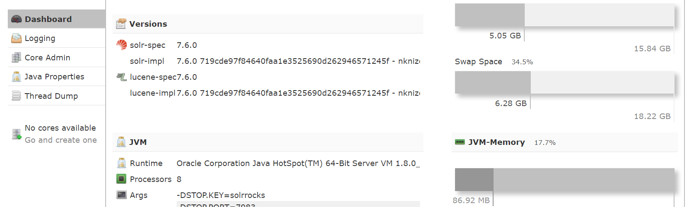

# Solr上手

## 安装Solr和启动Solr

1. 安装Solr
 先安装JDK，然后下载Solr[下载链接](https://lucene.apache.org/solr/mirrors-solr-latest-redir.html),下载文档后解压
2. 启动Solr,linux和Window启动应用不一样，Solr默认开启的端口是8983，启动后可以访问127.0.0.1:8983

 ```bash
C:\Users\PC\Desktop\框架\solr\solr-7.6.0>bin\solr.cmd start
INFO  - 2019-02-10 00:09:47.717; org.apache.solr.util.configuration.SSLCredentialProviderFactory;
Processing SSL Credential Provider chain: env;sysprop
Waiting up to 30 to see Solr running on port 8983
Started Solr server on port 8983. Happy searching!
 ```

3. 启动界面
 

4. 停止Solr

```bash
solr.cmd -p 8983 stop
```

## 目录结构

+ contrib目录包含扩展的源代码
+ dist目录包含contrib模块的JAR包
+ docs目录帮助文档
+ example目录Solr示例服务器
+ server目录Solr的服务端，比如:AdminUI，JettyLib，LogFiles
+ licenses目录相关依赖的许可证
+ bin目录包含几个重要的脚本让Solr使用简单
  + solr和solr.cmd是控制脚本，它们可以启动或者停止Solr或者创建collection或者内核
  + post，Post工具提供简单的命令提交内容到Solr
  + solr.in.sh或solr.in.cmd 可以一次性配置solr的环境变量属性的脚本，比如修改solr的端口号，只需要删除对应的注释就可以了
  >REM set SOLR_PORT=8983
  + install_solr_services.sh 在linux系统将solr作为一个服务。

## 添加示例

Solr的内核由配置文件，Lucene索引文件和Solr事务日志组成。Jetty上允许的一台Solr服务器可以控制多个内核。

集合(collection):它仅在单一索引分布在多个服务器的Solr集群语境下才有意义。

Solr为示例准备了好了文件，可以录入Solr用于演示和学习

1. 创建一个collection，允许完命令后可以控制台选择
`solr create -c collection1`
2. 将样例上传到Solr中
`java -Dc=collection1 -jar post.jar *.xml`
3. 访问查询地址可以得到结果
`http://127.0.0.1:8983/solr/collection1/select?q=*:*`

## 搜索面板

管理UI上有专用查询页面


|表单字段|取值|说明
|-|-|-|
|q|iPod|主查询参数：根据参数中的词项与文档的相似度，对文档评分|
|fq|manu:Belkin|过滤查询：通过过滤器筛选结果集文档，但不影响评分。|
|sort|price asc|指定排序字段与排序方式。按价格顺序排列|
|start|0|指定搜索结果的起始页|
|rows|10|页面大小，限制每项显式的结果数量|
|fl|name,price,features,score|在结果集中每个文档返回的字段列表。score字段时内置字段，描述查询相关度得分|
|df|text|未指定搜索字段的任意查询词项的默认搜索字段；text是全包含(catch-all)字段|
|wt|xml|响应输出类型|